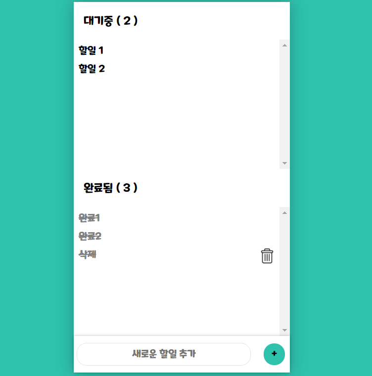

# CEOS Front-end 1주차 미션: Vanilla-Todo📝

## 미션 목표
---
- VSCode, Prettier를 이용하여 개발환경을 관리합니다.
- HTML/CSS의 기초를 이해합니다.
- JavaScript를 이용한 DOM 조작을 이해합니다.
- Vanilla.js를 이용한 어플리케이션 상태 관리 방법을 이해합니다.
---

## 결과 화면

### Key Questions
---
- DOM은 무엇인가요?
- HTML (tag) Element를 JavaScript로 생성하는 방법은 어떤 것이 있고, 어떤 방법이 가장 적합할까요?
- DOM에서 발생하는 Event는 방법에는 어떤 것이 있고, 어떤 방법이 가장 적합할까요?
- Flexbox Layout은 무엇이며, 어떻게 사용하나요?
- JavaScript가 다른 언어들에 비해 주목할만한 점에는 어떤 것들이 있나요?
- 코드의 추상화 수준이란 무엇인가요?
- 코드에서 주석을 다는 바람직한 방법은 무엇일까요?

### Key Quenstions Answer
 - https://www.notion.so/1-e6398e4499e24fe780eb124067b745e4

### 추가 작업
---
- 브라우저의 `localStorage` 이용하여 다음 번 접속 시에 기존 투두 데이터를 불러와보았다.

### 공부 및 참고한 자료
---
- [HTML/CSS 기초](https://heropy.blog/2019/04/24/html-css-starter/)
- [HTML 태그](https://heropy.blog/2019/05/26/html-elements/)
- [FlexBox 가이드](https://heropy.blog/2018/11/24/css-flexible-box/)
